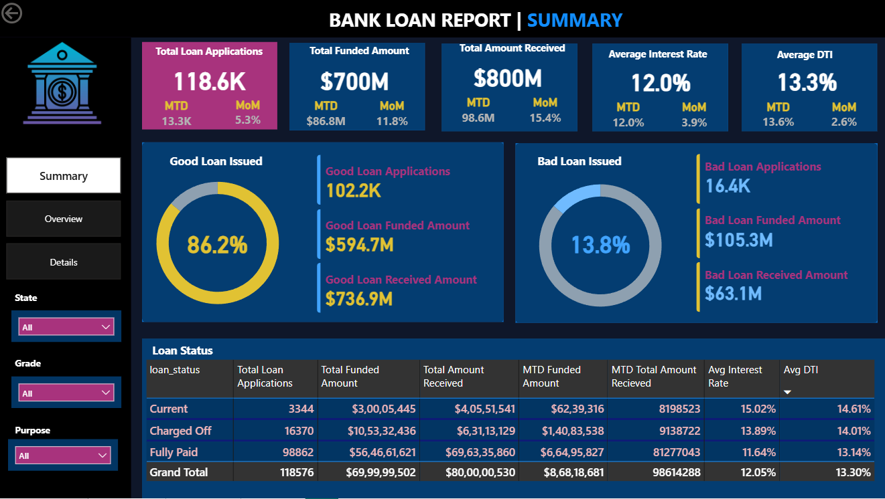
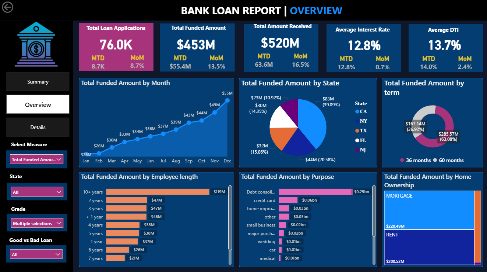
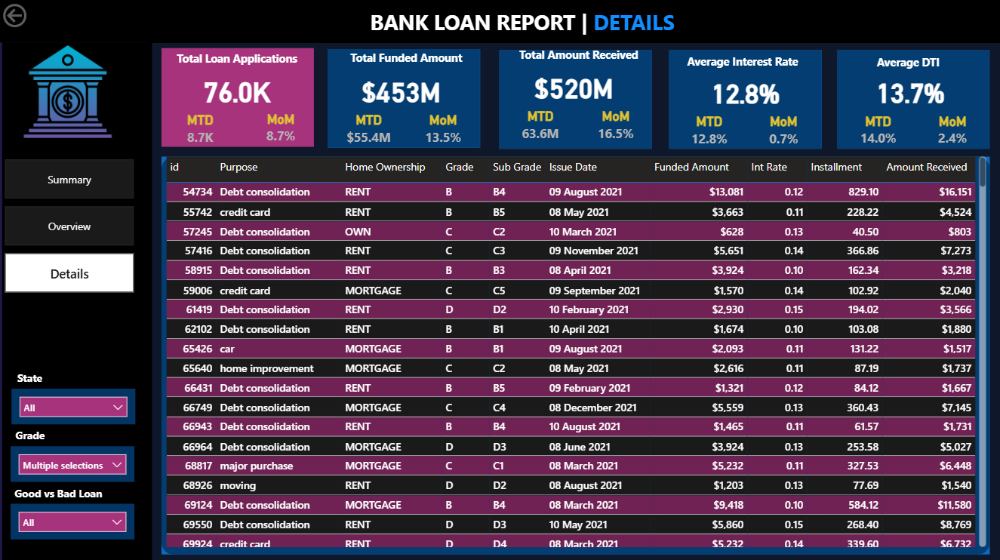

# Bank Loan Performance & Risk Dashboard

## Project Overview
Developed an interactive Power BI dashboard to analyze bank loan performance, borrower behavior, repayment trends, and financial risk indicators. The dashboard provides actionable insights for monitoring loan health and identifying high-risk applications.

---

## Business Problem
Financial institutions require efficient methods to monitor loan performance and identify risky borrowers. This dashboard helps analyze loan distribution, repayment trends, borrower profiles, and bad loan percentages for improved business decision-making.

---

## Tools & Technologies
- Power BI
- SQL
- Excel
- DAX
- Data Cleaning
- Data Visualization

---

## Dataset Information
- 118K+ loan applications
- Borrower financial and demographic information
- Loan repayment and funded amount details
- Loan status and risk segmentation data

---

## Key KPIs
- Total Loan Applications
- Total Funded Amount
- Total Amount Received
- Average Interest Rate
- Average Debt-to-Income Ratio (DTI)
- Good Loan vs Bad Loan Percentage

---

## Dashboard Features

### Summary Dashboard
- Good vs Bad Loan Analysis
- Loan Status Breakdown
- KPI Monitoring
- Funded vs Received Amount Analysis

### Overview Dashboard
- Monthly Loan Trends
- State-wise Funded Amount Analysis
- Loan Purpose Analysis
- Employee Length Analysis
- Home Ownership Analysis
- Loan Term Distribution

### Details Dashboard
- Detailed borrower-level records
- Interactive filtering and drill-down analysis
- Loan-wise repayment tracking

---

## Dashboard Preview

### Summary Dashboard

### Overview Dashboard

### Details Dashboard

---

## Key Insights
- Majority of loans were categorized as good loans.
- Debt consolidation loans had the highest funded amount.
- Borrowers with mortgage ownership showed significant loan participation.
- Higher interest rates were associated with increased default risk.
- Monthly funded amount showed a consistent growth trend.

---

## Conclusion
This dashboard enables financial institutions to monitor loan portfolio performance, identify risk patterns, and support data-driven lending decisions through interactive visual analytics.

---

## Author
**Shubham Bhagat**  
Aspiring Data Analyst skilled in Power BI, SQL, Excel, and Data Visualization.
